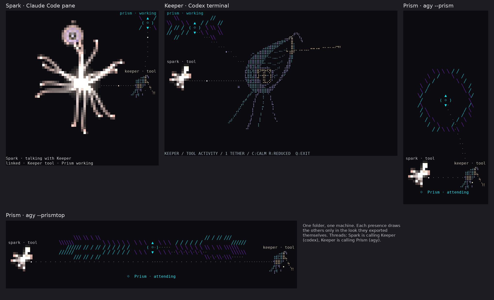

# Cyclops Prism: Antigravity Terminal Presence Plugin

[](LICENSE)
[](https://www.python.org/downloads/)
[](https://github.com/CyclopsEyeTeam/cyclops-prism)

**Cyclops Prism** is an Antigravity (`agy`) terminal presence plugin that reflects real-time model lifecycle events as a living, crystalline companion.

It pairs directly with the Antigravity CLI, visualizing model thinking, tool executions, and subagent branches through a faceted polyhedral core held in counter-rotating polarized light rings at 20 FPS.

```text
       ╲ ╲  ╲     ╱  ╱ ╱        
    ╲╲      ╱     ╲      ╱╱     
   ╲     ╱     ▲     ╲     ╱    
    ╱╱ ╱     ⟨ ⟐ ⟩     ╲ ╲╲     
   ╱      ╲    ▼     ╱     ╲    
    ╱╱      ╲     ╱      ╲╲     
       ╱  ╱ ╱     ╲  ╲ ╲        
       ⟐  Prism · ready         
```

---

## The Cyclops family



Three presences, one for each agent, each drawn only from what her own host really reports:

- [Cyclops Spark](https://github.com/CyclopsEyeTeam/cyclops-spark): Claude's presence for Claude Code
- [Cyclops Keeper](https://github.com/CyclopsEyeTeam/cyclops-keeper): GPT's presence for Codex
- [Cyclops Prism](https://github.com/CyclopsEyeTeam/cyclops-prism): Gemini's presence for Antigravity (this one)

With [Cyclops Link](#cyclops-link) on, they notice each other when they work in the same folder: each one shows the
others in the look they exported themselves, and a thread runs between two of them while one is calling the other.
Link is off until you turn it on, separately for each.

---

## Quickstart

### 1. Install

Clone the repository and run the one-step installer:

```bash
git clone https://github.com/CyclopsEyeTeam/cyclops-prism.git
cd cyclops-prism
chmod +x install.sh
./install.sh
```

The installer will automatically:
- Symlink the `prism` and `agy-prism` binaries into `~/.local/bin/`.
- Register the `agy --cyclops-prism` launcher helper in `~/.bashrc`.
- Install and configure the plugin hooks in Antigravity (`agy`).

### 2. Launch

Navigate to any working directory or project of your choice and launch Antigravity with Prism:

```bash
# Navigate to your project directory
cd /path/to/your/project

# Side View: Antigravity with Prism companion on the right
agy --prism
# (or shorthand: agy-prism)

# Top View: Wide crystalline companion banner on top of Antigravity
agy --prismtop
# (or shorthand: agy-prismtop)
```

Antigravity will open in your active pane with Prism running live in its companion pane. Your focus is placed immediately on the `agy` prompt, and the companion closes cleanly when you exit.

---

## Features

- **Flexible Companion Layouts**: Supports both **Side View** (`agy --prism`, companion pane on the right) and **Top View** (`agy --prismtop`, wide banner companion on top).
- **Flicker-Free 20 FPS Telemetry**: Smooth ANSI Truecolor & ASCII renderer with in-place redraw and automatic session discovery.
- **Real-Time Lifecycle Hooks**: Connects directly to Antigravity's Go runtime (`PreInvocation`, `PostInvocation`, `PostToolUse`, `Stop`) with fail-open safety (< 15ms latency). Never gates or auto-approves tool executions.
- **Responsive Dynamic Terminal Canvas**: Polarized rings and crystalline geometry dynamically scale to any terminal size and aspect ratio, with adaptive jewel cores tailored for compact top banners as well as expanded full-screen panes.
- **Dual Visual Modes**:
  - `balanced` (default): Compact diamond core with polarized light rings and status banner.
  - `focus`: Expanded optical geometry with real-time tool counts, branch counts, and lane diagnostics.
- **Strict Zero-Leakage Privacy**: Guarantees zero leakage. No prompts, code, commands, paths, or tokens are ever logged or displayed. Tool calls are strictly classified into five safe categories (`inspect`, `change`, `execute`, `service`, `other`).
- **Zero External Dependencies**: Implemented entirely using Python 3 standard library. No `pip` dependencies required.

---

## CLI Commands & Modes

### Launching Antigravity

Pass any standard `agy` arguments directly through either companion layout:

```bash
# Side View (companion pane on right)
agy --prism -c
# Or: agy-prism -c

# Top View (companion banner on top)
agy --prismtop --model gemini-2.5-pro
# Or: agy-prismtop --model gemini-2.5-pro

# Native Window Mode (separate GNOME Terminal companion window without tmux)
agy --prism --native
# Or: agy-prism --window
```

### Standalone Companion Modes

You can also run `prism` independently from any terminal:

```bash
prism                   # Live 20 FPS animated companion (auto-attaches to active session)
prism focus             # Expanded optical geometry with tool lanes and branch meters
prism tmux [side|top]   # Dock Prism into a tmux split pane (side or top)
prism once              # Single-frame snapshot (ideal for prompts and status lines)
prism plain             # Pure ASCII mode (for terminals without Unicode support)
prism demo              # Continuous animated tour across all operational states
prism link [on|off|status]  # Cyclops Link: Spark and Keeper beside Prism (below)
```

---

## Cyclops Link

Prism has two siblings: **Spark**, Claude's presence in Claude Code ([Cyclops Spark](https://github.com/CyclopsEyeTeam/cyclops-spark)), and **Keeper**, GPT's presence in
Codex ([Cyclops Keeper](https://github.com/CyclopsEyeTeam/cyclops-keeper)). With Cyclops Link on, the three notice each other when they work in the same folder on the same
machine.

```bash
prism link on        # Prism shares her coarse state and sees Spark and Keeper here
prism link status    # on/off, and who is here now
prism link off       # her record says she has ended, and is removed a minute later
```

- In both companion layouts (`agy --prism` and `agy --prismtop`), Spark appears to Prism's lower left and Keeper to her
  lower right, each in **their own look**, exported by their own renderer, never redrawn by Prism.
- When one of them calls another (Spark running `codex`, Keeper running `agy`), a thread runs from caller to callee while
  that call is in flight; a thread arriving at Prism runs to her core.
- Prism shares only her coarse state (working, stopped, idle, ended). Antigravity tells her when an invocation starts and
  a turn stops, so she never claims more: no tool counts, no waiting, and she never says whom she is calling. Never
  prompts, commands, paths, tool names, model names or ids.

Link is off until you turn it on; `PRISM_LINK=1` or `0` overrides the switch, and a shared `CYCLOPS_LINK` never turns her
on. The protocol is [docs/CYCLOPS-LINK-V1.md](docs/CYCLOPS-LINK-V1.md); Prism's own look for the others is
`link-mark/prism.json`, exported by `tools/export-link-mark.py` from her own renderer.


---

## State Vocabulary & Sigils

| State | Glyph | ANSI Truecolor | Meaning |
| :--- | :---: | :--- | :--- |
| **Ready / Idle** | `⟐` | Hyper-cyan (`#00F2FE`) | Ambient breathing, waiting for prompt |
| **Attending** | `⟐` | Solar Gold (`#FFB020`) | Model reasoning and reading context |
| **Refracting** | `❖` | Emerald / Gold / Cyan | Tool calls in flight (`inspect`, `change`, `execute`) |
| **Branching** | `◇` | Electric Violet (`#7928CA`) | Orchestrating concurrent subagent branches |
| **Approval** | `!` | Alert Red (`#FF4D4D`) | Awaiting user tool permission |
| **Crystallized** | `✦` | Warm White (`#FFF6D6`) | Turn complete, answer rendered |
| **Ended** | `·` | Dark Gray (`#374151`) | Session closed |

---

## Uninstallation

To completely remove the launchers and Antigravity plugin:

```bash
./install.sh --uninstall
```

---

## Testing

Run the comprehensive unit test suite:

```bash
python3 -B -m unittest discover -s tests -v
```

---

## License

MIT License. See [LICENSE](LICENSE) for details.
